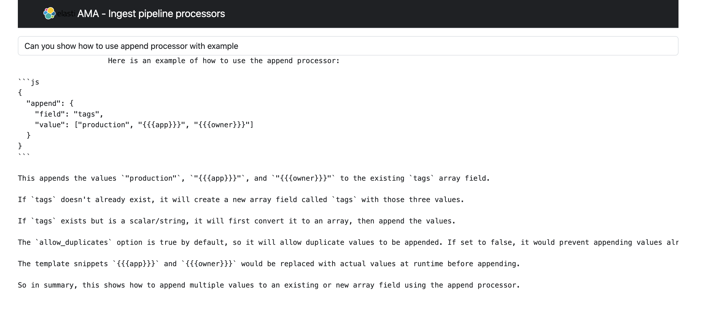

# Elasticsearch Search Tutorial

This directory contains a starter Flask project used in the Search tutorial.

1. Create a Python Virtual env and activate it

```code
bharat/search-tutorial - (main) > python3 -m venv .venv
bharat/search-tutorial - (main) > source .venv/bin/activate
```

2. Install the required dependencies from `requirements.txt`. This installs necessary dependencies in the python venv.

```code
bharat/search-tutorial - (main) > pip install -r requirements.txt
```

3. Create an elasticsearch deployment using docker. This project currently uses `8.13.1` elasticsearch

```command
docker run -p 9200:9200 -d --name elasticsearch \
  -e "discovery.type=single-node" \
  -e "xpack.security.enabled=false" \
  -e "xpack.security.http.ssl.enabled=false" \
  -e "xpack.license.self_generated.type=trial" \
  docker.elastic.co/elasticsearch/elasticsearch:8.13.1

```

4. Make sure you have aws creds updated and exported to your env. You can run

```code
(.venv) bharat/search-tutorial - (main) > aws-mfa --profile=<profile-name>
(.venv) bharat/search-tutorial - (main) > eval $(grep ^aws ~/.aws/credentials | gsed -r 's/^(aws[^ ]+) = (.*)$/export \U\1\E=\2/g')

```

5. Run the flask app which runs default on port `5001`. You can change the port in `.flaskenv` config.
You can leave this tab running.

```code
(.venv) bharat/search-tutorial - (main) > flask run

Connected to Elasticsearch!
{'cluster_name': 'docker-cluster',
 'cluster_uuid': 'some-id',
 'name': '8e8e67920fde',
 'tagline': 'You Know, for Search',
 'version': {'build_date': '2024-03-29T10:05:29.787251984Z',
             'build_flavor': 'default',
             'build_hash': 'some-hash',
             'build_snapshot': False,
             'build_type': 'docker',
             'lucene_version': '9.10.0',
             'minimum_index_compatibility_version': '7.0.0',
             'minimum_wire_compatibility_version': '7.17.0',
             'number': '8.13.1'}}
 * Debug mode: on
WARNING: This is a development server. Do not use it in a production deployment. Use a production WSGI server instead.
 * Running on http://127.0.0.1:5001
Press CTRL+C to quit

```

6. In a new tab [Re source the venv again as in step 1], deploy ELSER model by running

```
(.venv) bharat/search-tutorial - (main) > flask deploy-elser
Connected to Elasticsearch!
{'cluster_name': 'docker-cluster',
 'cluster_uuid': 'mYWB9Cz5RyWrtkwHubXoNQ',
 'name': '8e8e67920fde',
 'tagline': 'You Know, for Search',
 'version': {'build_date': '2024-03-29T10:05:29.787251984Z',
             'build_flavor': 'default',
             'build_hash': '9287f29bba5e270bd51d557b8daccb7d118ba247',
             'build_snapshot': False,
             'build_type': 'docker',
             'lucene_version': '9.10.0',
             'minimum_index_compatibility_version': '7.0.0',
             'minimum_wire_compatibility_version': '7.17.0',
             'number': '8.13.1'}}
ELSER model deployed.
```

7. Go to a browser and navigate to `http://localhost:5001` and type in your search query to get desired result from the LLM.


